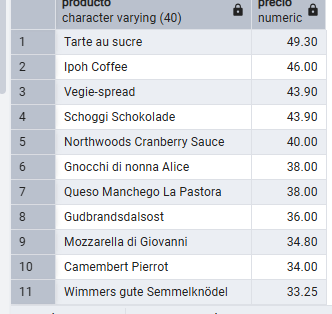
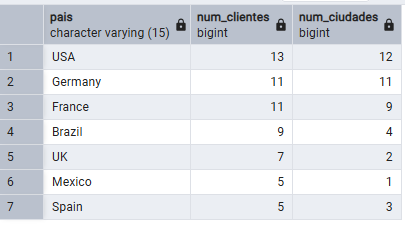
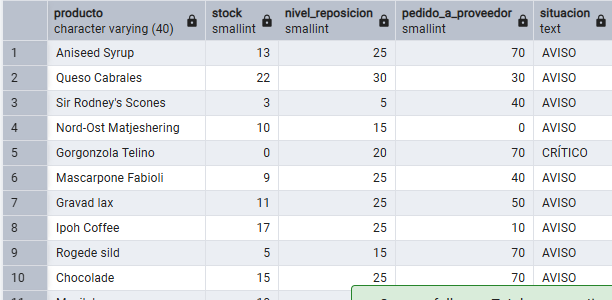

SELECT product_name AS producto,
       ROUND(unit_price::numeric, 2) AS precio
FROM products
WHERE discontinued = 0
  AND unit_price BETWEEN 10 AND 50
ORDER BY precio DESC;

SELECT country AS pais,
       COUNT(customer_id) AS num_clientes,
       COUNT(DISTINCT city) AS num_ciudades
FROM customers
GROUP BY country
HAVING COUNT(customer_id) >= 5
ORDER BY num_clientes DESC;

SELECT product_name AS producto,
       units_in_stock AS stock,
       reorder_level AS nivel_reposicion,
       units_on_order AS pedido_a_proveedor,
       CASE 
           WHEN units_in_stock = 0 THEN 'CRÍTICO'
           ELSE 'AVISO'
       END AS situacion
FROM products
WHERE discontinued = 0
  AND units_in_stock <= reorder_level;

